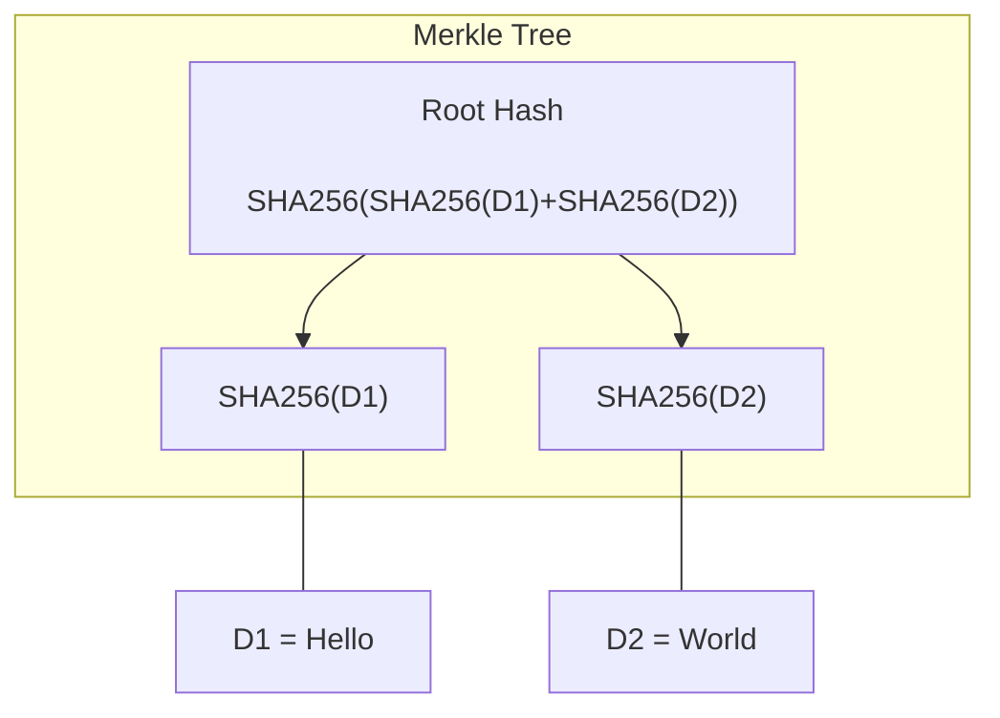
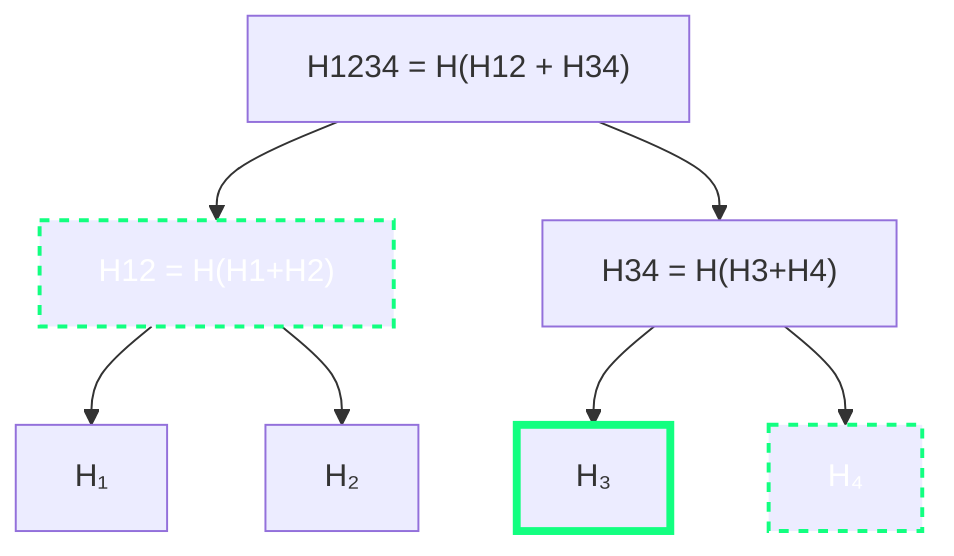
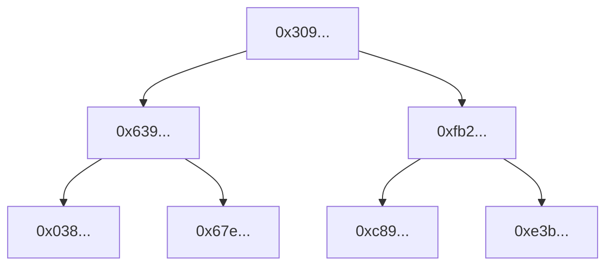

# SAFE - Take-home assignment
# Task
Write a brief tutorial explaining how Merkle Proofs work.
Please cover the following topics in your post:
- Explanation of what Merkle Trees are for a technical audience with no web3 knowledge.
- Explanation of how Merkle Proofs would work for a whitelisting of three email addresses.
- Demonstrate it with an implementation of this in Javascript/Typescript and explain the code. Feel free to use an existing library to implement a Merkle Tree (there is no need to build a frontend for this).
## Merkle Trees and Merkle Proofs
Merkle trees are a hash-based data structure that is commonly used by Web3 and Smart Contract developers. In this article we are going to explore some of it's benefits in this area. 
### Introduction to Merkle Trees
A merkle tree is a binary tree that is constructed from arbitrary data with the use of a fixed hash function. The main advantage of this data structure is that it allows us to prove the inclusion of a certain piece of data in this tree without the need to actually store the data itself. This is possible through the clever use of hash function combined with a tree structure. A hash function can take an input of arbitrary length and always produces a *unique* fixed-length string. This means, that two different pieces of data will always result in two different hashes.

Before describing the general construction procedure for Merkle trees we start with a very simple example. The following diagram depicts a Merkle tree based on the two strings "Hello" and "World" using the `SHA-256` hash function. This Merkle tree has only three nodes: Two leaves and a root node.


The leaf nodes of the Merkle tree are constructed by hashing the two strings `D1` and `D2` using the `SHA-256` hash function. The root node is then obtained by concatenating these two hashes and hashing them once more. Note that the actual data, the strings `D1` and `D2`, is not part of the tree, only their hashes are.

In this simple case, it would most likely not be a problem to store the actual data, i.e. the strings themlselves, in the tree. However, the same principle can be applied to input data of arbitrary size. This is why Merkle trees are ubiquitoues in Blockchain applications where block space is very expensive and the efficiency of our algorithms is very important. 2) Th


1. **Start with Leaf Nodes**: Begin with your list of hash values. These hashes are the leaf nodes of the Merkle tree.
2. **Pair and Hash**: If the number of leaf nodes is not even, duplicate the last hash to make it even. Then, pair up the leaf nodes. For each pair, concatenate their hashes and hash this concatenated value. This creates the parent nodes one level up in the tree.
3. **Repeat Process**: Repeat the pairing and hashing process for each level of the tree. If a level has an odd number of nodes, duplicate the last node to make it even, then pair and hash them. Continue this process until you reach the top of the tree. This single hash is the root of the Merkle tree. The root hash represents the entire set of leaf nodes and is used to verify the contents of the tree.


### Merkle Proofs
A Merkle proof is a set of hashes that can be used to verify that a specific leaf is part of a Merkle tree. 

Returning to our previous example, if we want to confirm that the string "Hello" is a leaf of the given Merkle tree we would 


**Example**: The Merkle proof for $H_4$ is given by the array of hashes [$H_4$, $H_{12}$]. Given the root $H_{1234}$ of the tree we can proceede as follows:
1. Compute $H'_{34}$ by concatenating and then hashing $H_3$ and $H_4$.
2. Compute $H'_{1234}$ by concatenating and then hashing $H_{12}$ and the previously computed $H'_{34}$.
3. Compare $H_{1234}$ with the computed $H'_{1234}$. If the hashes are equal the proof is valid, otherwise it is invalid.


1. **Identify the Leaf**: First, identify the specific leaf node for which you want to create a proof. In a Merkle tree, each leaf is typically a hash of some data.

2. **Generate the Proof Path**: Starting from the identified leaf, move up the tree. At each level, select the sibling node (the node adjacent to the current node) and add it to the proof list. The sibling node is necessary because it provides the information needed to reconstruct the parent node at each step. Continue this process of moving up the tree, selecting sibling nodes at each level, until you reach the root of the Merkle tree. The collection of these sibling nodes forms the Merkle proof.

### Example: Using Merkle Trees to Whitelist Mailaddresses
A common application of Merkle trees in Web3 is to use them for whitelisting purposes. 
### 3. JS Implementation using `merkletreejs`
**Prerequisites**: Node.js, npm

In this example, we are going to use the JS library `merkletreejs` to implement a Merkle tree for mail whitelisting. More specifcally, we will showcase how to construct a Merkle tree based on the three mail addresses and how to construct and verify a corresponding Merkle proof for one of the addresses.

First create a new folder, initialise a fresh `npm` package and install `merkletreejs`, as well as `crypto-js`:
```bash
npm init -y
npm install merkletreejs crypto-js 
```

Next create an empty `merkle.js` file and paste the following code snippet:
```Javascript
const { MerkleTree } = require('merkletreejs')
const SHA256 = require('crypto-js/sha256')

// Sample data
const leaves = ['satoshi@nakamoto.com', 'vitalik@buterin.ca', 'gavin@wood.de', ''].map(x => SHA256(x))

// Initialize the Merkle Tree
const tree = new MerkleTree(leaves, SHA256);

// Log the tree
console.log('Merkle tree:\n', tree.toString());
```

This short code snippet implements the situation from above, where we constructed a Merkle tree using mail addresses as input data. As you can see we additionally added an empty string to the `leaves` array to balance the tree. We are using the `SHA256` implementation of `crypto-js` to obtain the `leaves` from our data, which serves as the base of the Merkle tree. After this, we are initializing a new Merkle tree by calling the `MerkleTree` constructor from `merkletreejs` and passing our `leaves` array, as well as the `SHA256` hash function. 

Running `node merkle.js` will log the newly created Merkle tree to the console:
```bash
Merkle tree:
 └─ 3091e77ff091717dbc4c42aaa48ed37c3da445916e86a19466a38eee2f74cb28
   ├─ 639983b835d9c5320b34589e9523d2859bb99f91a2f81caea526a6ed03567150
   │  ├─ 038a33cbcf36f6fe7f270188fc4cd48087cd6dddc2120d39d5e225191676183e
   │  └─ 67e7a3cbbe8c4dd8bd640170dcf45b7181aa7b73c03a3449df2fbe392e494501
   └─ fb228476e81f4e4edd4b9d5ed03ed5b54cf37e9098e3835ae6df6b92410a78f3
      ├─ c89a41f732b7981100fcc6bec235c83aec0e1674c692dc475b226ee56a4aea76
      └─ e3b0c44298fc1c149afbf4c8996fb92427ae41e4649b934ca495991b7852b855
```
This output corresponds to the following tree diagram:


If we wanted to confirm that the address `vitalik@buterin.ca` is part of this Merkle tree we can use the `getHexProof` method of the `tree` object to obtain a Merkle proof in hexadecimal representation. For this we only need the address hash. Add the following lines to your existing code:
```Javascript
// Get the Merkle proof for 'vitalik@buterin.ca'
const leaf = SHA256('vitalik@buterin.ca');
const proof = tree.getHexProof(leaf);

// Output the proof
console.log('Merkle Proof for "vitalik@buterin.ca":', proof);
```
Running `node merkle.js` again will log the desired Merkle proof to the console:
```bash
Merkle Proof for "vitalik@buterin.ca": [
  '0x038a33cbcf36f6fe7f270188fc4cd48087cd6dddc2120d39d5e225191676183e',
  '0xfb228476e81f4e4edd4b9d5ed03ed5b54cf37e9098e3835ae6df6b92410a78f3'
]
```
Since the address `vitalik@buterin.ca` corresponds to the second leaf node from the left, we can visually confirm using the above tree diagram, that these are exactly the hashes needed for a valid Merkle proof. To confirm the validity of this proof, we can use the `verify` method of the `tree` object. Extend your code with the following lines and run `node merkle.js` once more:
```Javascript
// Get the root of the tree
const root = tree.getRoot().toString('hex');

// Verify the proof for 'vitalik@buterin.ca'
console.log(tree.verify(proof, leaf, root)) // true
```


